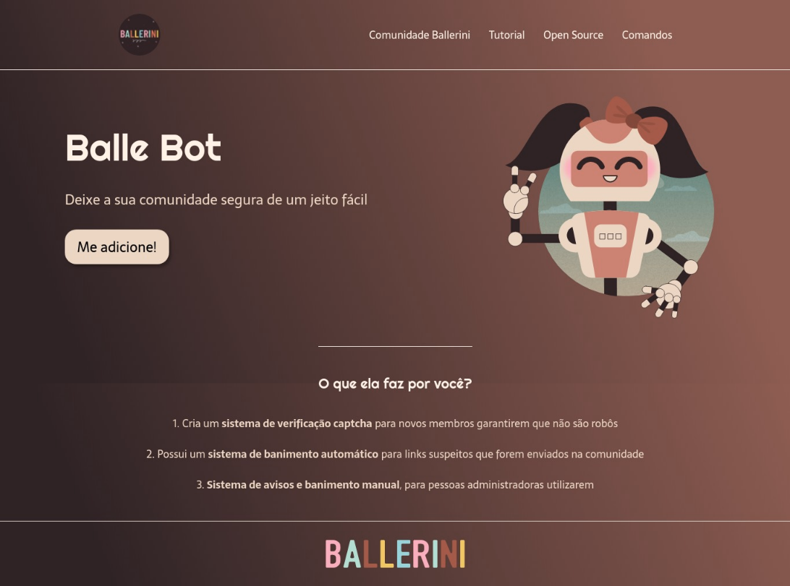

# Landing Page - **Balle Bot** :robot:

    <a href="#tecnologia">Tecnologias</a>&nbsp;|&nbsp;
    <a href="#sobre">Sobre</a>&nbsp;|&nbsp;
    <a href="#layout">Layout</a>&nbsp;

    <h1>Tecnologias</h1>
    
Página desenvolvida através das tecnologias:

    <ul>
        <li>HTML5</li>
        <li>CSS3</li>
        <li>Flexbox</li>
    </ul>

 

    <h1>Sobre</h1>
    
Página desenvolvida com base no vídeo <strong><a href="https://www.youtube.com/watch?v=llF6vD-RljE&ab_channel=RafaellaBallerini">LANDING PAGE COM HTML e CSS!</a></strong> da @rafaballerini.

 

    <h1>Layout</h1>
    

